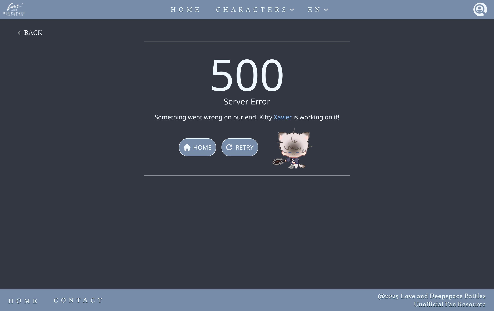
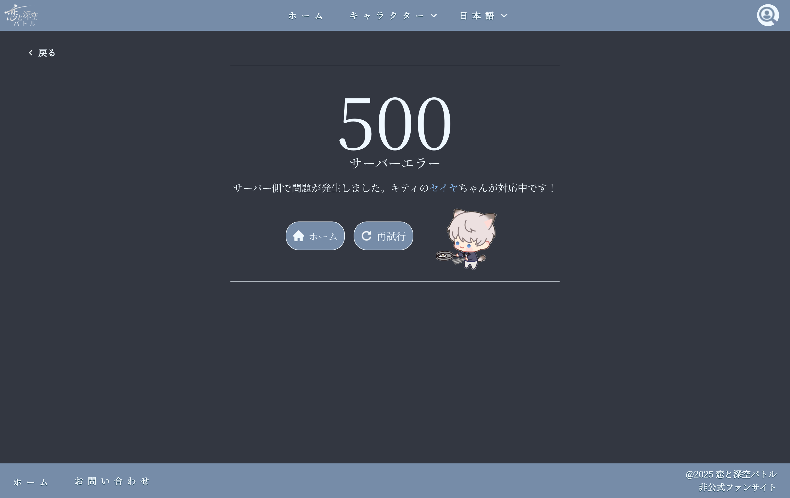
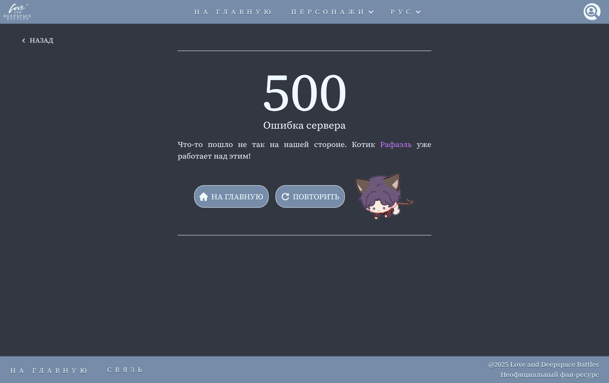

<h1 align=center> 恋と深空バトルガイド</h1>

  
  
  
  
  
  
  

## 📋 プロジェクト概要
「恋と深空（Love and Deepspace）」の戦闘メカニズムに特化したファンメイドガイドサイトです。パートナーの詳細なガイド、武器情報、スキル解説、ゲームプレイ戦略を多言語で提供します。

> **技術的な設計背景や詳細な実装意図については英語版READMEにて詳しく記載しております。** ➞ [README.md](README.md) | [GitHub プロフィール](https://github.com/rue-eru) 
> 🇯🇵 このプロジェクトは日本語完全対応です。採用ご検討の際はぜひデモをご覧ください。 
> 🖥️ [デモはこちら](https://lads-battles.vercel.app/ja)

スクリーンショットと動画

## プロジェクトスクリーンショット

| ページ | EN Locale | 日本語 Locale | РУС Locale |
|:-------:|:----------:|:---------:|:---------:|
| **ホームページ** |  |  |  |
| **キャラクター一覧** | |  |  |
| **パートナー一覧** |  |  |  |
| **ガイドなしページ** |  |  |  |
| **ガイドページ** |  |  |  |
| **5★ガイドページ** |  |  |  |
| **404ページ** |  |  |  |
| **500ページ** |  |  |  |
| **お問い合わせページ** |  |  |  |

## プロジェクトGIFアニメ

| PC表示 |
|---|
|  |

| モバイル表示 |
|---|
|  |

---

## ✨ 主な機能

### 1. 多言語対応 (EN/JA/RU)
- 完全な日本語ローカライゼーション実装
- 日本語フォント最適化 (Noto Serif JP: Google Font ➞ Local Font WOFF2)
- 動的ルーティングによる言語切り替え

### 2. パフォーマンス最適化
- 日本語フォントサイズ 90%削減 (1.3MBのみ)
- 画像最適化 (Image/next)
- Lighthouse によるパフォーマンス計測（Vercel 本番環境）
- デスクトップ表示: 90〜100 点
- モバイル表示: 80〜90 点（コンテンツ量を考慮）
- Accessibility / Best Practices / SEO: 安定して 100 点

## ⚙️ 技術スタック
- **Next.js 16**: App Router を活用した最新アーキテクチャ
- **TypeScript**: 型安全なデータ管理
- **Tailwind CSS 4**: 効率的なスタイリング
- **next-intl**: スケーラブルな国際化対応

## 🏗️ アーキテクチャの特徴

### データ層
- JSONファイルによる動的データ管理
- TypeScriptインターフェースによる型安全

### コンポーネント構造
- 機能ベースのコンポーネント分割
- Server / Client Component の責務分離

### 国際化
- 名前空間ベースの翻訳ファイル構造
- 3言語完全対応 (英語/日本語/ロシア語)

## 📊 プロジェクト実績

- **6ページ**の詳細なキャラクターガイド（ホムラ）
- **100+** 画像の最適化処理
- **3言語**の完全なローカライゼーション
- **レスポンシブデザイン** (モバイル/タブレット/デスクトップ対応)

## ❕翻訳に関する注記
- **英語**: オリジナルコンテンツ（流暢レベル）
- **ロシア語**: 自己翻訳（母国語レベル）
- **日本語**: AI支援による自然な表現調整
  - N2レベルを基盤に、ゲーム専門用語はAIで自然な表現に調整
  - ゲーム以外のUI翻訳は主に自己翻訳
  - 全訳の正確性は確認済み

## 🎯 採用担当者様へ

このプロジェクトは以下のスキルを実証しています：
1. **国際化対応能力**: 日本語を含む多言語Webアプリケーション開発経験
2. **パフォーマンス最適化**: Lighthouseを用いた計測と改善実績
3. **モダンなフロントエンド技術**: Next.js App Router, React 19, TypeScript
4. **実務を意識したコード品質**: ESLint / TypeScript strict mode

---

<i>
最初公開: 2026年2月7日 
最終更新: 2026年2月17日
</i>

